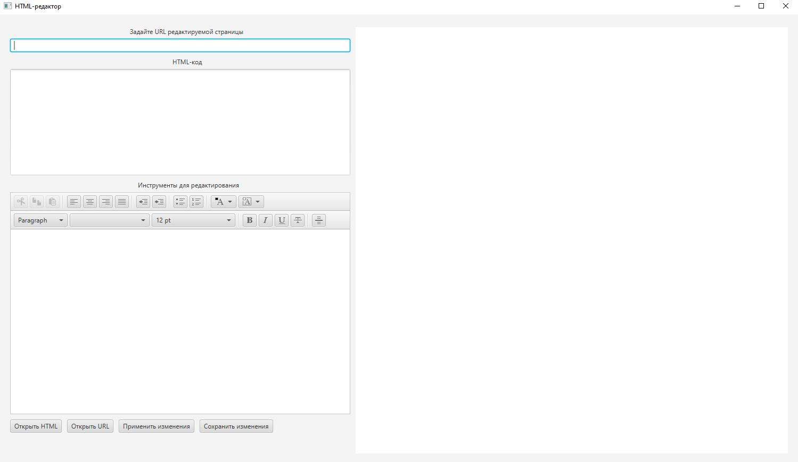
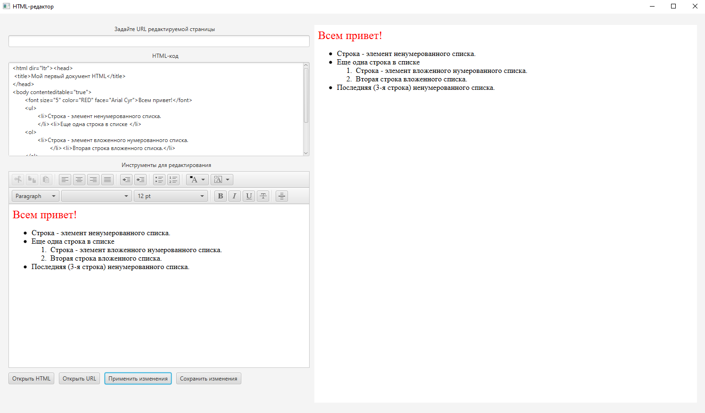
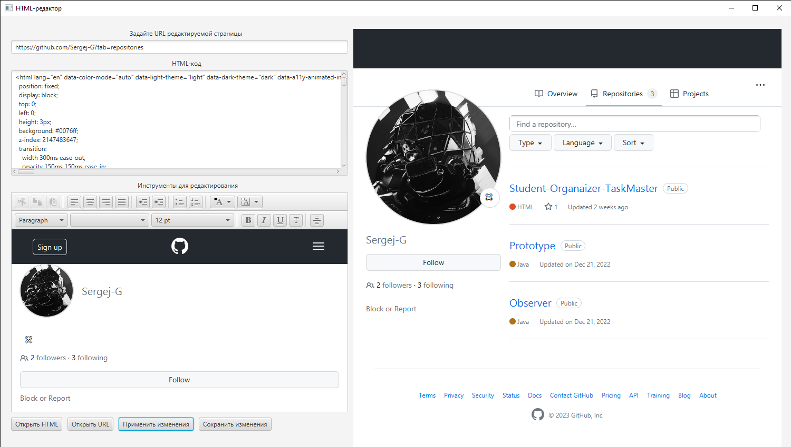
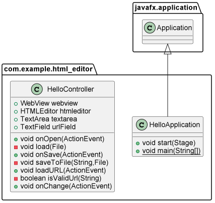

# HTML-редактор

**Описание**
HTML-редактор - это программное обеспечение, которое позволяет создавать, редактировать и просматривать веб-страницы, используя язык гипертекстовой разметки (HTML).

Скриншот главного окна
---

Открытие HTML-файла
---

Скриншот HTML через URL
---

Диаграмма классов
---

