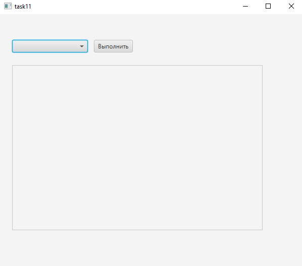
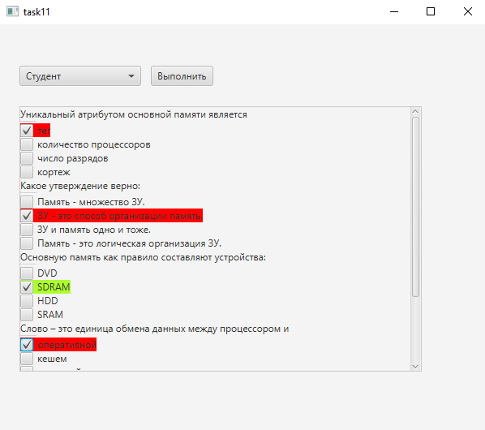
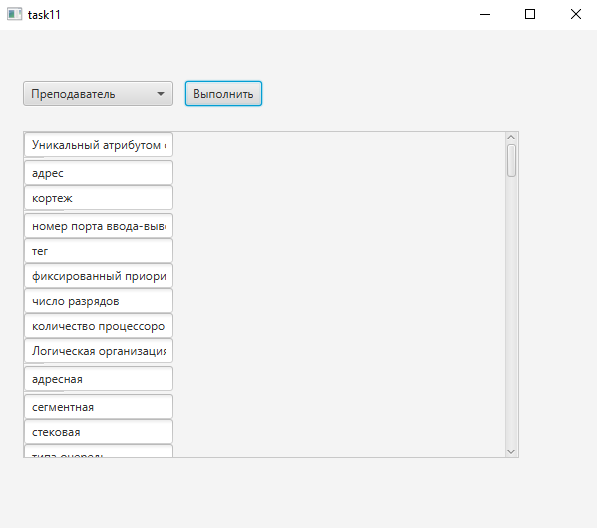
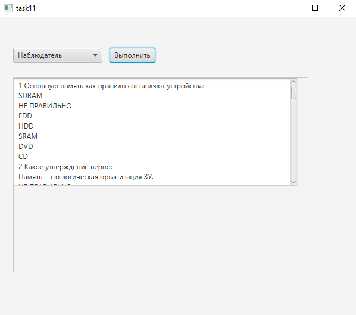
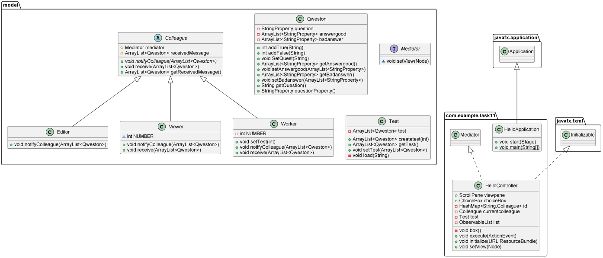

# Медиатор

**Описание**
--
Приложение представляет собой программный модуль авторизации в системе тестирования с тремя уровнями доступа:
- L1 "Студент " отвечает на вопросы теста. 
- L2 "Преподаватель" создает, редактирует и размещает  тестовые задания.
- L3 "Посетитель"  может только просматривать содержимое тестовых заданий.

Скриншот главного окна
---

Скриншот окна пользователя "Студент"
---

Скриншот окна пользователя "Преподаватель"
---

Скриншот окна пользователя "Наблюдатель"
---

Диаграмма классов
---

