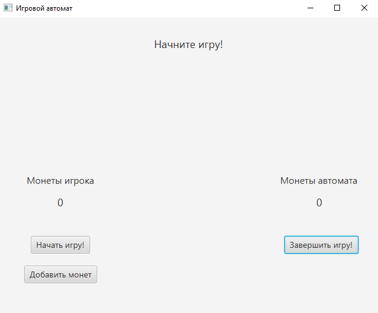
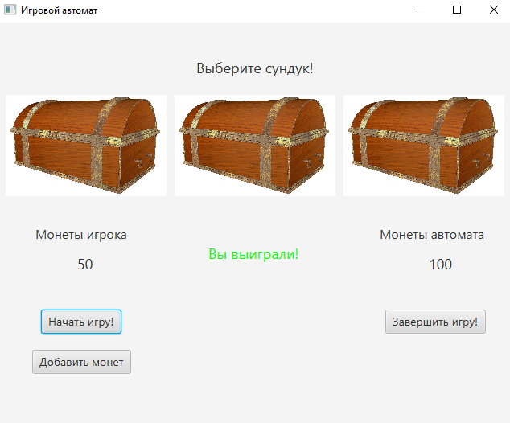
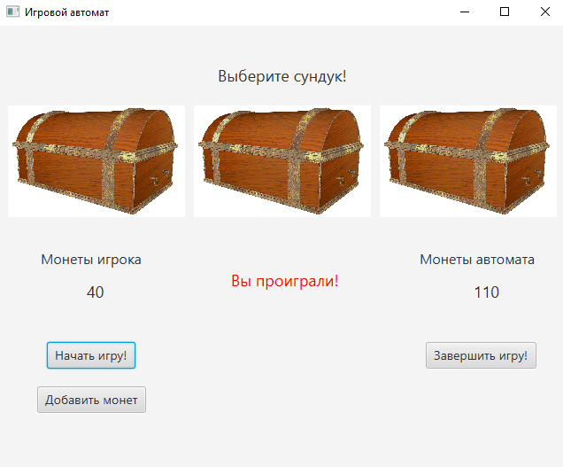
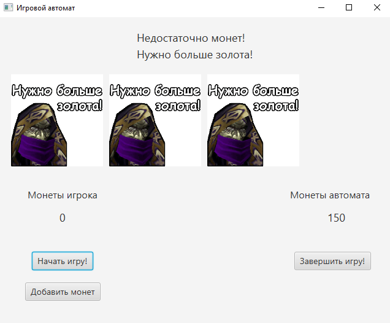
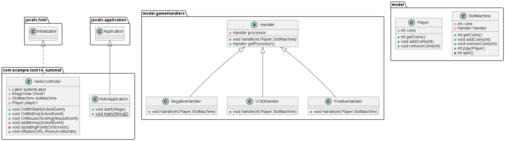

# Цепочка обязанностей

**Описание**
--
Данное приложение имитирует игровой автомат и использует паттерн "Цепочка обязанностей", 
чтобы создать цепочку объектов-обработчиков. Каждый объект в цепочке может обработать запрос 
или передать его следующему объекту в цикле. В игровом автомате используются три обработчика: 
PositiveHandler, NegativeHandler и VOIDHandler. PositiveHandler обрабатывает выигрышные результаты, 
NegativeHandler - проигрышные результаты, а VOIDHandler - ситуацию, когда у игрока или автомата заканчиваются монеты.

Скриншот главного окна
---

Скриншот окна во время начала игры
---

Скриншот окна в момент выигрыша 
---

Скриншот окна в момент проигрыша 
---

Скриншот окна в момент полного проигрыша всех монет
---

Диаграмма классов
---

