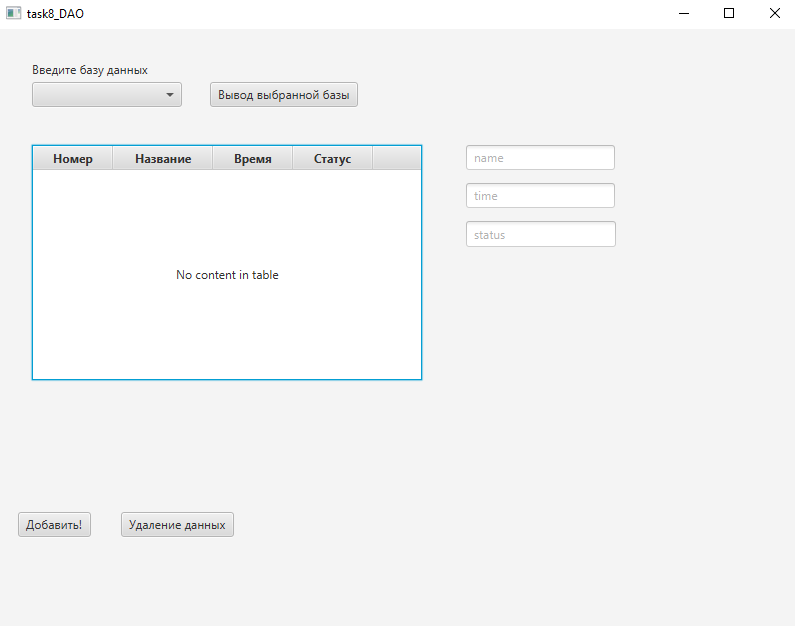
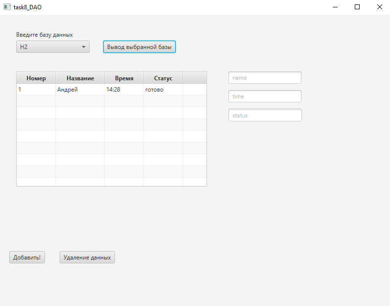
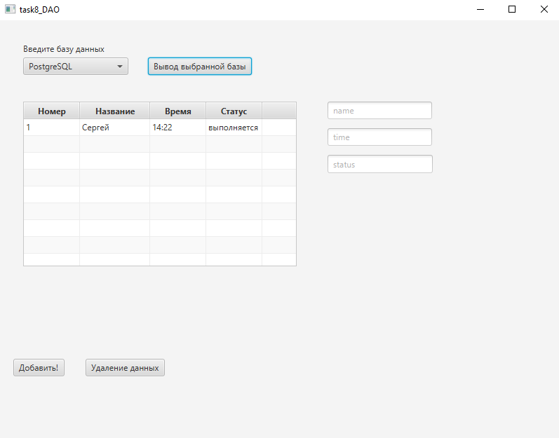

# DAO

**Описание**
--
Приложение предоставляет возможность добавлять записи в таблицу базы данных при помощи паттерна DAO.
Также пользователь может выбирать в какую базу данных добавлять записи и просматривать их.

Скриншот главного окна
---

Скриншот окна работы с базой данных H2
---

Скриншот окна работы с базой данных PostgreSQL
---

Диаграмма классов
---

